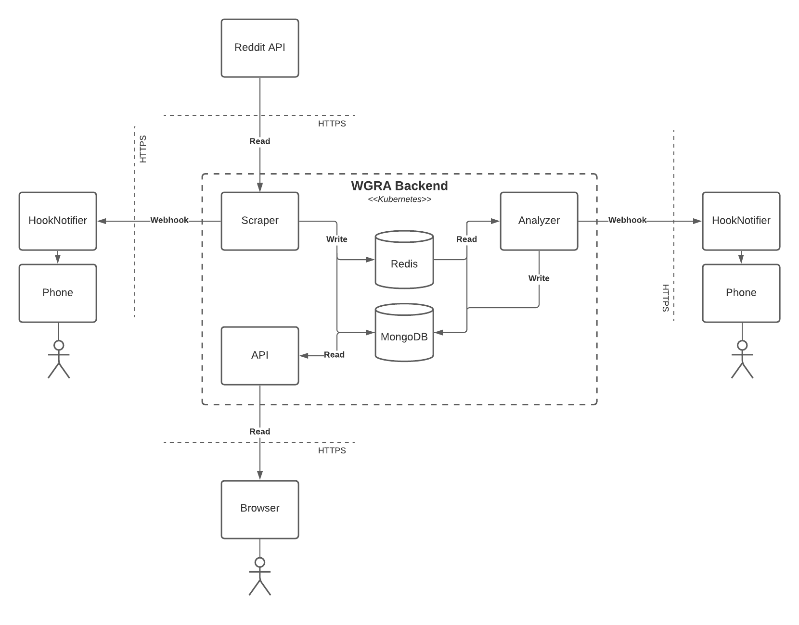

# Word Growth Rate Analyzer

## The Goal of this Project

The objective of this project is, to automatically analyse, store and notify about long and short-term trends. This will be done by counting and comparing the occurrences of any given word within a given timeline.

## Project Architecture

## Technical Risks

### Fluctuation between peak hours

Since users are more active at different times of the day, and at different days of the week, we will get large fluctuations in the growth rate of each word. While this doesn't result in a direct problem, since in relation to other words, the resulting growth rate will stay meaningful, it will cause our dataset to become less readable.

To resolve this problem, we need to calculate the growth rate of each word, based on the occurrence of the most common word, in our case "the". As an example, if we want to calculate the growth rate of the word "hello", we need the following inputs to calculate the growth rate.

| Word  | Time Frame    | Occurrences |
| :---- | :------------ | :---------- |
| hello | 15:00 - 16:00 | 4000        |
| hello | 16:00 - 17:00 | 6000        |
| the   | 15:00 - 16:00 | 120.000     |
| the   | 16:00 - 17:00 | 150.000     |

Given our example input, it may seem as if we have a growth rate of 50% for the word "hello" between our two time frames, but in reality we first need to take the word "the" - our most occurring word - as a baseline. In order to accomplish this, we need to divide the occurrences of "the", with the occurrences of "the" from the time frame before, meaning `150.000 / 120.000`. This will give us `1.25`, which is the growth rate in user activity between those time frames. Now we need to multiply the occurrences of the word "hello" in our first time frame with our user growth rate, which results in `4000 * 1.25 = 5000`. Now we can calculate the true growth rate by dividing the occurrences of one time frame with the time frame before using our adjusted occurrences, `6000 / 5000 = 1.2`. Now we know, that the true growth rate is 20%, and not 50%.

### Spam messages

If a user decides to write the word "foobar" hundreds of times in one comment, all occurrences will be added to our database, and the growth rate would be enormous. To take this problem, we can implement two potential solutions.

1. We require a specific threshold, if a word is under this threshold, say 50 occurrences, we won't calculate the growth rate, since its value is not significant enough.
2. Spam messages usually only occur once. If the occurrence for the word is back to normal after one time frame, we know that it was spam and can ignore it.
